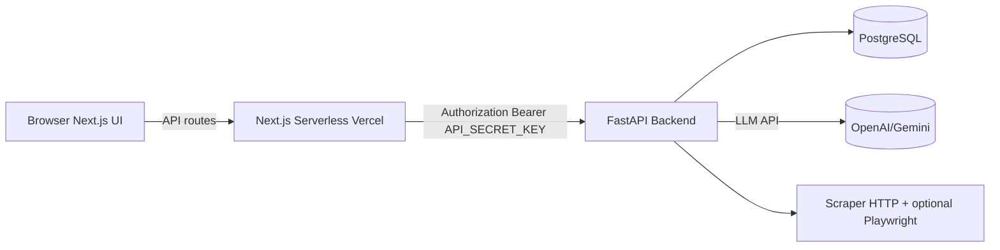

# WebSage

Homepage-only website analyzer with FastAPI + Next.js. Scrapes a site's homepage, extracts company insights, answers custom questions using an LLM, and supports follow‑up Q&A tied to an analysis session.

## Deployment

- Backend (FastAPI) URL: https://REPLACE_WITH_YOUR_BACKEND
- Frontend (Next.js) URL: https://REPLACE_WITH_YOUR_FRONTEND
- Hosting services used:
  - Backend: Render or Railway
  - Frontend: Vercel

### Environment Keys

- Shared
  - `API_SECRET_KEY`: Shared bearer token used by frontend to call backend
- Backend
  - `DATABASE_URL`: Postgres connection URL
  - `AI_PROVIDER`: `openai` or `gemini`
  - OpenAI: `OPENAI_API_KEY`, `OPENAI_MODEL` (default: `gpt-4o-mini`)
  - Gemini: `GEMINI_API_KEY`, `GEMINI_MODEL` (default: `gemini-1.5-pro`)
  - `REDIS_URL` (optional for rate limits; defaults for docker-compose)
  - Scraper knobs: `SCRAPER_TIMEOUT_SECONDS`, `SCRAPER_MAX_REDIRECTS`, `SCRAPER_USER_AGENT`, `ALLOWED_SCHEMES`, `DISALLOW_PRIVATE_IPS`
  - Playwright fallback: `PLAYWRIGHT_ENABLED`, `PLAYWRIGHT_TIMEOUT_SECONDS`
- Frontend
  - `BACKEND_URL`: Public FastAPI URL
  - `API_SECRET_KEY`: Same value as backend

See `backend/env.example` and `frontend/env.example`.

## Architecture Diagram



## Technology Justification

- FastAPI: modern, typed, async I/O; excellent with Pydantic validation and OpenAPI.
- SQLAlchemy + Postgres: simple persistence for sessions, snapshots, company info, contact info, extracted Q&A, and chat exchanges.
- Pydantic: request/response models, strict validation and serialization.
- Async scraping: non‑blocking HTTP fetch; optional Playwright fallback when needed.
- Next.js: serverless API proxy + clean UI.

## AI Model Used & Rationale

- Default: Gemini 1.5 Pro (good long‑context web extraction, sensible costs). Switchable to OpenAI via `AI_PROVIDER`.

## Local Setup

### Quickstart (backend + frontend)

1) Backend
```
cd backend
cp env.example .env
python -m venv .venv && source .venv/bin/activate
pip install -r requirements.txt
alembic upgrade head
uvicorn main:app --reload --host 0.0.0.0 --port 8000
```

2) Frontend
```
cd frontend
cp env.example .env.local
yarn install
yarn dev
```

### With Docker Compose

```
docker compose up --build
```

## API Usage Examples

Base URL: `${BACKEND_URL}` (e.g., http://localhost:8000)

1) Analyze homepage
```
curl -X POST "$BACKEND_URL/analyze" \
  -H "Authorization: Bearer $API_SECRET_KEY" \
  -H "Content-Type: application/json" \
  -d '{"url":"https://example.com","questions":["What industry?","Company size?"]}'
```

2) List sessions
```
curl -H "Authorization: Bearer $API_SECRET_KEY" "$BACKEND_URL/analyze/sessions"
```

3) Session detail (insights + extracted answers)
```
curl -H "Authorization: Bearer $API_SECRET_KEY" "$BACKEND_URL/analyze/sessions/<session_id>"
```

4) Converse (follow‑up question)
```
curl -X POST "$BACKEND_URL/converse" \
  -H "Authorization: Bearer $API_SECRET_KEY" \
  -H "Content-Type: application/json" \
  -d '{"session_id":"<session_id>","query":"Who are competitors?"}'
```

5) Conversation history
```
curl -H "Authorization: Bearer $API_SECRET_KEY" "$BACKEND_URL/converse/history/<session_id>"
```

## Running Tests

Backend tests (pytest):
```
cd backend
pytest -q
```

## Development Notes

- Robust error handling and validation via FastAPI + Pydantic.
- Only homepage is fetched; no crawling.
- Async scraping for performance; Playwright fallback is optional/disabled by default.
- Rate limiting supported; can be backed by Redis in production.

## IDE Used

- Cursor (VS Code compatible)


